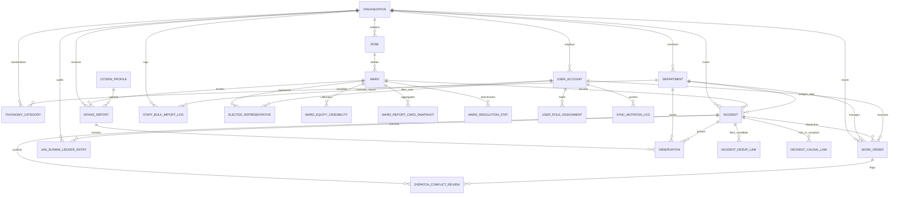
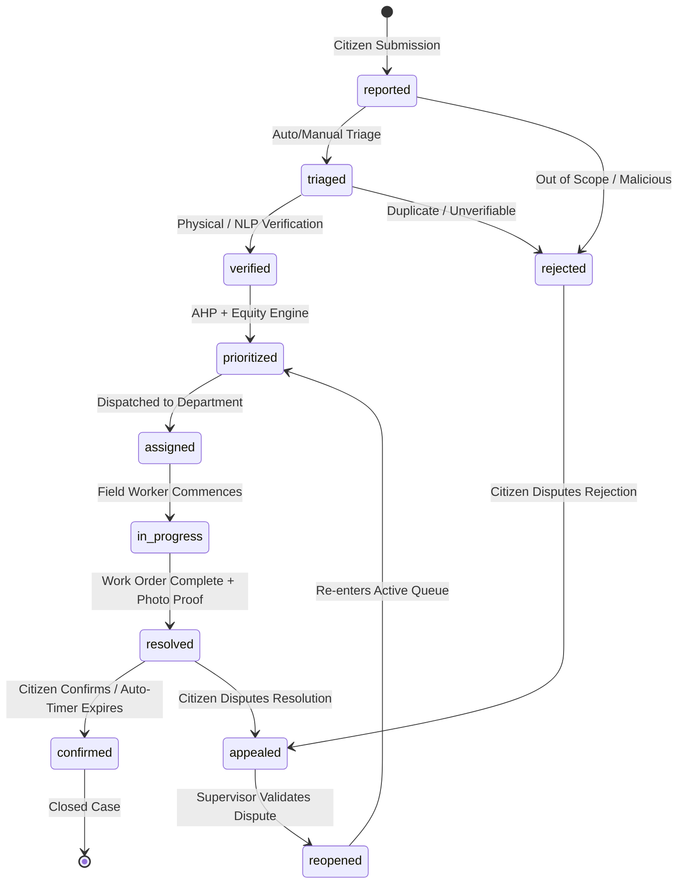

# CivicBrain: Complete Reference Document for Frontend Engineers & Designers

> **Document Status**: Production Reference  
> **Source Verification**: Grounded directly in live database queries (`information_schema`, `pg_enum`, `pg_policies`), the live `/v1/openapi.json` specification (46 paths, 50 operations), and repository architecture ground truth (`.agents/RULES.md`).  
> **Target Audience**: Frontend designers, UI/UX engineers, and full-stack developers building interface clients for CivicBrain v14.

---

## 1. Project Theme & Pitch

CivicBrain is not another generic citizen grievance redressing ticketing tool, and it is not an opaque "AI-wrapper" chatbot. As established in the v14 Master Specification (§A1–A3), CivicBrain is a **civic prioritization and dispatch intelligence system** designed to sit directly on top of existing urban municipal infrastructure (such as CPGRAMS or DIGIT/UPYOG). Its mission is to transform disorganized, multi-channel citizen complaints into an **itemized, appealable, mathematically equity-corrected priority ranking** across all open civic issues city-wide.

Unlike conventional smart-city platforms that collapse when expensive hardware is absent, CivicBrain operates on the **Bootstrap Principle (§A3)** via Bühlmann empirical credibility theory: it assumes **zero day-one government asset registries, zero census socioeconomic statistics, and zero IoT sensor networks**. Every baseline, repair time estimate, and vulnerability rating is derived transparently from the platform’s own accumulated, verified operational history, blending city-wide priors into ward-level reality as data volume grows ($Z = \frac{n}{n + K}$). The UI must never pretend to know things it does not; it exposes confidence, itemizes scoring rubrics, and treats evidence-based verification as a sacred trust between citizens and their local urban government.

---

## 2. Naming & Terminology Glossary

### 2.1 Workspace Naming Table (§A5, §A18)

CivicBrain divides municipal operations into seven dedicated, purpose-built workspaces. Frontend designs must use these standardized dual names and cater to their distinct user cohorts:

| English Workspace Name | Companion / Indian Vernacular Name | Primary User Persona / Cohort | Purpose & Interaction Style |
| :--- | :--- | :--- | :--- |
| **Citizen Portal / PWA** | **Nagrik Setu** (नागरिक सेतु) | Citizens, Residents, Civil Society | High-accessibility, multilingual intake (photo/voice/text) with transparent tracking token status and dispute flow. |
| **Command Deck** | **Command Deck** (कमांड डेक) | Dispatchers, Duty Officers, Operations Chiefs | City-wide incident triage, cross-department handoffs, manual overrides, and offline sync conflict adjudication. |
| **Ops Board** | **Ops Board** (ऑप्स बोर्ड) | Department Supervisors, Junior Engineers (JE) | Departmental queue management (Roads, SWM, Water, Drains, Electrical, Health) and work order dispatching. |
| **City Pulse** | **City Pulse** (सिटी पल्स) | Zonal Supervisors, Urban Data Analysts | Spatial GIS heatmaps, DBSCAN cluster analysis, seasonal monsoon alerts, and root-cause causal graphs. |
| **Field Companion** | **Karmi Sahayak** (कर्मी सहायक) | Field Workers, Inspectors, Sanitation Leads | Mobile-first, low-bandwidth/offline PWA for claiming work orders, navigating routes, and submitting photo proof. |
| **Control Room** | **Control Room** (कंट्रोल रूम) | Municipal Commissioners, System Admins | Tenant administration, staff bulk-onboarding, AHP weight calibration, and taxonomy governance. |
| **Transparency Board** | **Jan Sunwai Ledger** / **Nagar Pragati** | Corporators (Ward Councilors), Public, Media | Public cryptographic audit ledger, ward report cards, Nagar Pragati city feeds, and read-only AI Assistant. |

---

### 2.2 Plain-English Domain Glossary

Every domain term returned by the `/v1/` APIs has a strict, unambiguous operational meaning:

- **`intake_report`**: A citizen submission bundle containing raw input (photos, voice audio, text notes, GPS location, and channel metadata), which may contain multiple distinct civic defects spanning different municipal departments.
- **`observation`**: A single atomic civic defect extracted from an intake report's multi-issue media/text by computer vision or NLP, scoped to exactly one municipal department.
- **`incident`**: The canonical, deduplicated municipal defect record tracked through the 11-stage city lifecycle, clustered from one or many citizen observations in the same geographic radius over time.
- **`work_order`**: An operational dispatch task generated for a specific municipal department and assigned to a field worker or crew to physically inspect, repair, or resolve an incident.
- **`dispatch_conflict_review`**: A supervisory queue item generated when a field worker's offline synchronization collides with a concurrent server update, holding the change for manual dispatcher adjudication.
- **`taxonomy_category`**: An approved municipal civic classification (e.g., Pothole, Overflowing Garbage, Open Manhole) governed under a specific department with a defined baseline severity rubric.
- **`raw_priority_score`**: An unadjusted multi-criteria score ($0.0 - 1.0$) computed via the Analytical Hierarchy Process (AHP) comparing technical criteria: Severity, Risk, Exposure, Criticality, and Urgency.
- **`equity_boost`**: A compensatory multiplier ($\beta \ge 0$) derived from historical reporting density and ward vulnerability using Bühlmann credibility to neutralize systemic reporting biases in underserved wards.
- **`priority_score`**: The final composite priority rank ($0.0 - 1.0$) used to order dispatch queues, calculated as $\text{raw\_priority\_score} \times (1 + \text{equity\_boost})$.
- **`confidence_score`**: A statistical certainty value ($0.0 - 1.0$) calculated via Bühlmann credibility ($Z = \frac{n}{n + K}$), communicating how much empirical local history supports an automated prediction or score.
- **`Severity` vs. `Risk` vs. `Exposure` vs. `Criticality` vs. `Urgency`**:
  - *Severity*: The intrinsic physical magnitude or engineering grade of the defect itself (e.g., a deep trench vs. a hairline asphalt crack).
  - *Risk*: The immediate danger of human injury, disease outbreak, vehicular collision, or cascading infrastructure collapse.
  - *Exposure*: The daily human population volume or traffic density directly impacted by the defect.
  - *Criticality*: The systemic municipal importance of the affected facility (e.g., an arterial hospital access road vs. a dead-end residential alley).
  - *Urgency*: The temporal rate of escalation requiring intervention before damage multiplies (e.g., an active potable water main rupture flooding adjacent power conduits).

---

## 3. Design Principles the UI Must Reflect

Frontend engineers and designers must adhere to four non-negotiable principles derived from §A3 and §A12:

### 3.1 Confidence is First-Class, Never Hidden
- **Why**: Under the Bootstrap Principle, the system openly acknowledges cold-start uncertainty. When a ward has only 2 historical reports ($n=2$), the system's credibility factor is low ($Z \approx 0.1$). 
- **UI Requirement**: Any automated ETA, predicted category, or recommended priority score **must** display its companion confidence indicator (e.g., "Confidence: 38% — Calibrating on collective city priors"). Never present an automated calculation as an infallible decree.

### 3.2 Evidence (Photos & GPS) is Central, Not an Attachment
- **Why**: Civic disputes hinge on physical reality. A closed ticket without visual proof erodes public trust and invites administrative corruption.
- **UI Requirement**: Photos are prominent cards with GPS timestamps and redaction badges (for blurred license plates/faces), not tiny attachment icons buried at the bottom of a form. Work order completion requires side-by-side "Before vs. After" visual cards.

### 3.3 Itemized Score Breakdowns Over Opaque Single Numbers
- **Why**: An unappealable black-box score ($78/100$) invites political skepticism and claims of favoritism from corporators and citizens.
- **UI Requirement**: The priority score must render as an expandable breakdown showing the exact AHP sub-score contributions:
  $$\text{Priority Score} = [S \cdot w_s + R \cdot w_r + E \cdot w_e + C \cdot w_c + U \cdot w_u] \times (1 + \text{Equity Boost})$$
  The user should see exactly how much the base severity, the school proximity, and the ward equity boost contributed to their rank.

### 3.4 Status is Per-Observation, Never Prematurely Collapsed
- **Why**: A citizen often snaps one photo capturing an overflowing drain that flooded an electrical junction box. This spawns two child incidents: one for Stormwater Drains, one for Electricity.
- **UI Requirement**: Nagrik Setu **must** show individual progress bars for each distinct issue. The overall parent intake report status remains anchored to the **least-advanced child** (`InProgress`) even if one department finishes early. Never show "Resolved" to a citizen until all hazards are cleared.

---

## 4. Complete Entity Relationship Map

The live CivicBrain PostgreSQL database contains exactly **25 domain tables** (excluding PostGIS `spatial_ref_sys`). Below is the complete relationship map derived directly from the live foreign key constraints in the database:

### Table Inventory by Domain Subsystem:

1. **Tenant & Organizational Structure (5 tables)**:
   - `organization`: Root ULB municipal entity (e.g., BBMP, Pune Municipal Corporation).
   - `zone`: Administrative subdivisions with spatial polygon boundaries.
   - `ward`: Granular electoral and administrative wards with spatial geometries.
   - `department`: Official municipal departments (Roads, SWM, Water, Drains, Electrical, Health).
   - `elected_representative`: Links ward corporators to user accounts.

2. **Staff Identity & RBAC (3 tables)**:
   - `user_account`: Staff profiles linked directly to Supabase Auth (`auth.users`).
   - `user_role_assignment`: Granular staff role grants scoped by department, zone, or ward.
   - `staff_bulk_import_log`: Immutable audit log of all admin CSV batch user creation events.

3. **Citizen Intake & Clustering (4 tables)**:
   - `citizen_profile`: Citizen identities authenticated via Phone OTP or DigiLocker.
   - `intake_report`: Citizen submissions with tracking tokens, channel provenance, and aggregated status.
   - `observation`: Atomic extracted defects with department tagging and spatial point coordinates.
   - `incident`: Consolidated municipal cases with priority scoring and lifecycle state machine.

4. **Incident Deduplication & Causal Intelligence (2 tables)**:
   - `incident_dedup_link`: Probabilistic record linkage decisions (exact/probable/distinct) via Fellegi-Sunter.
   - `incident_causal_link`: Directed causal edges linking upstream root causes to downstream symptoms.

5. **Dispatch, Field Operations & Offline Sync (3 tables)**:
   - `work_order`: Operational field assignments with SLA targets, evidence photos, and completion notes.
   - `dispatch_conflict_review`: Supervisory adjudication queue for conflicting offline sync mutations.
   - `sync_mutation_log`: Immutable replay audit of offline mutations submitted by field workers.

6. **Prioritization, AHP & Credibility Equity (3 tables)**:
   - `ahp_matrix_config`: Analytical Hierarchy Process pairwise comparison matrices and consistency ratios.
   - `ward_equity_credibility`: Ward reporting volumes, vulnerability indices, and Bühlmann credibility factors ($Z$).
   - `category_service_time_prior`: City-wide baseline repair duration priors per taxonomy category.

7. **Analytics, Performance & Public Transparency (5 tables)**:
   - `taxonomy_category`: Master list of civic categories with severity rubrics and resolution SLAs.
   - `ward_resolution_stat`: Historical median resolution hours and sample sizes per category and ward.
   - `ward_report_card_snapshot`: Periodic ward scorecard metrics (open, resolved, SLA adherence, equity score).
   - `nagar_pragati_city_snapshot`: City-level aggregated progress metrics and public performance indexes.
   - `jan_sunwai_ledger_entry`: Immutable public transparency ledger tracking all case transitions.

---

## 5. Complete Live API Surface

The CivicBrain backend serves **46 unique endpoint paths** comprising **50 HTTP operations**. Below is the complete surface, grouped by the workspace it powers:

### 5.1 Nagrik Setu (Citizen Intake & Tracking)
- `POST /v1/intake/reports` (Public / Anon) — Submit a new citizen report (voice/photo/text/GPS).
- `POST /v1/intake/reports/photo` (Public / Anon) — Multipart photo upload with automatic face/license plate redaction.
- `GET /v1/intake/reports/track` (Public / Anon) — Query report status by tracking token or phone number.
- `POST /v1/intake/reports/{tracking_token}/confirm` (Public / Anon) — Citizen confirms physical resolution satisfaction.
- `POST /v1/intake/reports/{tracking_token}/dispute` (Public / Anon) — Citizen disputes premature or unsatisfactory closure.
- `POST /v1/nlp/analyze` (Public / Anon) — Parse natural language text (transliteration, language, emotion decoupling).

### 5.2 Command Deck & Ops Board (Triage, Dispatch & Management)
- `GET /v1/incidents` (Auth: Staff) — Filter and search incidents across departments, wards, and statuses.
- `GET /v1/incidents/{incident_id}` (Auth: Staff) — Retrieve full incident details, observations, and causal links.
- `GET /v1/incidents/{incident_id}/observations` (Auth: Staff) — List all atomic citizen observations tied to an incident.
- `PATCH /v1/incidents/{incident_id}/status` (Auth: Dispatcher / Admin) — Update incident lifecycle state.
- `POST /v1/prioritization/evaluate` (Auth: Dispatcher / Admin) — Re-run AHP and equity prioritization scoring on an incident.
- `GET /v1/dispatch/work-orders` (Auth: Dispatcher / Dept Staff) — Query departmental work orders with SLA timers.
- `POST /v1/dispatch/work-orders` (Auth: Dispatcher / Dept Staff) — Create and dispatch a new work order to a field worker.
- `GET /v1/dispatch/conflicts` (Auth: Dispatcher / Admin) — View offline field sync conflict queue.
- `POST /v1/dispatch/conflicts/{conflict_id}/adjudicate` (Auth: Dispatcher / Admin) — Approve or dismiss a worker's conflicting mutation.
- `POST /v1/dispatch/cron/auto-confirm` (Auth: Service / Cron Secret) — Auto-confirm resolved tickets after citizen response window expires.

### 5.3 Karmi Sahayak (Field Operations & Offline Companion)
- `GET /v1/dispatch/work-orders/my` (Auth: Field Worker) — Fetch assigned work orders for the authenticated worker.
- `POST /v1/dispatch/work-orders/{work_order_id}/start` (Auth: Field Worker) — Mark an assigned work order as `in_progress`.
- `POST /v1/dispatch/work-orders/{work_order_id}/resolve` (Auth: Field Worker) — Submit completion photo proof, notes, and resolve work order.
- `POST /v1/dispatch/sync` (Auth: Field Worker) — Two-way offline sync pushing client mutation lattice and pulling assigned tasks.
- `GET /v1/dispatch/sync/conflicts` (Auth: Field Worker) — View status of worker's disputed sync mutations.

### 5.4 City Pulse (GIS, Clusters & Causal Analytics)
- `GET /v1/gis/incidents/geojson` (Public / Staff) — Direct GeoJSON FeatureCollection of open incidents with bounding box filter.
- `GET /v1/gis/wards/geojson` (Public / Staff) — Direct GeoJSON FeatureCollection of municipal ward boundary polygons.
- `GET /v1/gis/clusters` (Auth: Staff) — Spatial DBSCAN density clusters identifying systemic civic hotspots.
- `GET /v1/causal/links` (Auth: Staff) — List directed causal links between upstream and downstream incidents.
- `POST /v1/causal/links` (Auth: Staff) — Manually link an upstream root-cause incident to a downstream symptom.
- `GET /v1/causal/incidents/{incident_id}/downstream` (Auth: Staff) — Fetch the cascading symptom graph for a root-cause incident.
- `GET /v1/analytics/incidents/{incident_id}/eta` (Auth: Staff) — Calculate deterministic completion time and confidence interval.

### 5.5 Control Room (Admin, Taxonomy & Tenant Governance)
- `GET /v1/admin/users` (Auth: Admin) — List all registered staff accounts across roles in the organization.
- `POST /v1/admin/users` (Auth: Admin) — Create an individual staff user with role and scope assignments.
- `POST /v1/admin/users/import` (Auth: Admin) — Multipart CSV bulk import for operational staff with dry-run and passwordless invite links.
- `POST /v1/orgs/{org_id}/departments` (Auth: Admin) — Create a new municipal department under an organization tenant.
- `GET /v1/orgs/{org_id}/hierarchy` (Auth: Staff) — Fetch full ULB tree (Organization &rarr; Zones &rarr; Wards &rarr; Departments).
- `GET /v1/orgs/{org_id}/wards/{ward_id}/representative` (Auth: Staff) — Fetch elected corporator profile for a specific ward.
- `POST /v1/orgs/{org_id}/wards/{ward_id}/representative` (Auth: Admin) — Assign or update the elected corporator for a ward.
- `GET /v1/taxonomy/categories` (Public / Staff) — Retrieve official civic categories filtered by department.
- `POST /v1/taxonomy/categories` (Auth: Admin) — Propose a new category into the Living Taxonomy.
- `POST /v1/taxonomy/categories/{category_id}/approve` (Auth: Admin) — Officially approve a category with its baseline severity rubric.
- `GET /v1/prioritization/ahp/matrix` (Auth: Admin) — Inspect current AHP pairwise weights and Consistency Ratio.
- `PUT /v1/prioritization/ahp/matrix` (Auth: Admin) — Update AHP criteria matrix (strictly validated for consistency).
- `GET /v1/prioritization/ahp/matrix/active` (Auth: Admin) — View currently active AHP weight vector.
- `GET /v1/prioritization/equity/wards/{ward_id}` (Auth: Staff) — View ward equity vulnerability score and credibility multiplier.
- `GET /v1/analytics/priors` (Auth: Admin / Staff) — View city-wide baseline repair time priors.
- `POST /v1/analytics/priors` (Auth: Admin) — Recalibrate empirical service-time priors.

### 5.6 Transparency Board (Public Ledger & Council Accountability)
- `GET /v1/transparency/ledger` (Public / Anon) — Query immutable audit ledger of all incident state transitions.
- `GET /v1/transparency/ledger/incidents/{incident_id}/chain` (Public / Anon) — Fetch complete cryptographic provenance history for a case.
- `GET /v1/transparency/pragati` (Public / Anon) — Fetch city-wide Nagar Pragati progress metrics and resolution rates.
- `POST /v1/transparency/assistant/query` (Public / Anon) — Multilingual read-only civic inquiry assistant (local deterministic templates).
- `GET /v1/analytics/wards/{ward_id}/report-card` (Public / Corporator) — Generate periodic ward performance scorecard.
- `GET /v1/analytics/corporator/digest` (Auth: Corporator / Admin) — Fetch weekly councilor executive digest for assigned ward.

### 5.7 System Infrastructure & Diagnostics
- `GET /v1/auth/me` (Auth: Authenticated) — Decode current Supabase JWT and return user roles, scopes, and permissions.
- `GET /v1/health` (Public) — System liveness check (Postgres, Redis, app version).
- `GET /v1/ready` (Public) — Readiness probe verifying migration state and cache connectivity.

---

## 6. Role & Permission Matrix

The live database defines exactly **6 staff roles** in `staff_role_enum`, plus the citizen tier. Permissions are enforced by PostgreSQL Row-Level Security (RLS) policies:

| Role Name (`staff_role_enum`) | Workspace Access | Accessible Scope | Primary Actions & Data Grants |
| :--- | :--- | :--- | :--- |
| **`citizen`** (Anon / OTP) | Nagrik Setu, Transparency Board | Own reports & Public Ledger | Create reports, upload photos, track token status, submit resolution confirmation/dispute, query public GeoJSON & Ledger. |
| **`field_worker`** | Karmi Sahayak | Assigned Work Orders | Fetch assigned tasks, start work, submit completion proof photos, perform 2-way delta sync. Blocked from viewing other departments. |
| **`department_staff`** | Ops Board | Department-wide within Org | View departmental queues, assign work orders to field workers, view departmental GIS overlays and SLA timers. |
| **`dispatcher`** | Command Deck | City-wide within Org | Triage incoming incidents, adjust priority, perform department handoffs, adjudicate offline sync conflicts, dispatch work orders. |
| **`zonal_supervisor`** | City Pulse | Zone-wide within Org | View zonal heatmaps, inspect DBSCAN clusters, review cross-department causal links, analyze ward report cards. |
| **`corporator`** | Transparency Board / Jan Sunwai | Assigned Ward strictly | Access Ward Digest, Ward Report Cards, view ward-level resolution stats. Cannot modify operational queues or reassign workers. |
| **`admin`** | Control Room & All Boards | Organization-wide (Tenant) | Full tenant governance: bulk import staff, create departments, approve taxonomy categories, calibrate AHP weights, manage councilors. |

---

## 7. Status & Lifecycle Flows

### 7.1 The Canonical 11-State Incident Machine

Queried directly from PostgreSQL `incident_status_enum`:

### 7.2 Least-Advanced-Child Status Aggregation Rule (§A7)

When an `intake_report` produces multiple child `observation` items across different departments, the parent intake report tracks the **least-advanced status** among its child incidents:

| Status Progression Rank | Status Value |
| :---: | :--- |
| 1 (Lowest) | `submitted` |
| 2 | `processing` |
| 3 | `triaged` |
| 4 | `in_progress` |
| 5 | `partially_resolved` |
| 6 | `resolved` |
| 7 (Highest) | `closed` |

*Rule*: If Observation 1 (Roads) is `resolved`, but Observation 2 (Electrical) is `in_progress`, the citizen's parent intake report status **must remain `in_progress`** (or `partially_resolved` on the UI tracker). It transitions to `resolved` only when **all** child incidents reach `resolved`.

### 7.3 Work Order Lifecycle (`work_order_status_enum`)
`created` &rarr; `dispatched` &rarr; `accepted` &rarr; `in_progress` &rarr; `completed`  
*(Exception: `cancelled` can be invoked by a dispatcher prior to completion).*

### 7.4 Offline Sync & Conflict Adjudication Flow
1. Field worker performs offline operations in **Karmi Sahayak**, queueing mutations locally in IndexedDB.
2. Upon reconnecting, the client calls `POST /v1/dispatch/sync`.
3. If the server detects a concurrency collision (e.g., ticket was re-assigned or cancelled on the server while the worker completed it offline), the server records a `dispatch_conflict_review` entry with `status = 'pending'`.
4. The ticket appears on the **Command Deck** conflict queue.
5. The dispatcher reviews the evidence and calls `POST /v1/dispatch/conflicts/{conflict_id}/adjudicate`:
   - `decision: "accept"`: Worker's offline completion overrides server and commits.
   - `decision: "dismiss"`: Worker's change is rejected, and client is instructed to rollback state.

---

## 8. What's Real vs. Not Yet Built (Honest Cold-Start Disclosure)

To prevent frontend designers from creating mock UI features that misrepresent backend capabilities, the following distinctions are strictly documented:

### 8.1 What is Real & Fully Functional
- **Complete REST API**: All 46 paths and 50 operations documented in OpenAPI are live and tested.
- **Database & RLS**: All 25 tables, foreign keys, and Row-Level Security policies are actively enforced in Supabase PostgreSQL.
- **Deterministic Prioritization Engine**: Analytical Hierarchy Process (AHP) and Bühlmann Credibility Equity Compensators are fully implemented without LLM dependencies.
- **Deduplication Engine**: Fellegi-Sunter record linkage math calculates match probabilities between incoming observations and existing incidents.
- **Offline Sync Engine**: Two-way delta synchronization and supervisory conflict review endpoints are live.
- **Admin Bulk-Import System**: CSV batch uploading with dry-run pre-flight, formula injection defense, and passwordless activation links.

### 8.2 What is Honest Cold-Start (Do NOT Mock Fake AI Confidence)
- **Computer Vision Pipeline**: The CV system is in an **honest cold-start** state. Observations default to citizen-declared categories or `unclassified`. 
  > **Designer Warning**: Do NOT design UI cards that show `"AI Detected: Pothole (98.4% confidence)"`. This would be fraudulent. The UI must cleanly show "Citizen Declared" or "Pending Automated Triage".
- **NLP Pipeline**: Keyword extraction, transliteration, and rule-based intent parsing are operational with cold-start fallback templates.

### 8.3 What is Specified-but-Unbuilt (Do NOT Build Screens for These Yet)
- **Proactive Inspection Engine**: Algorithmic decay curves predicting asset failures before citizen reports (specified in Post-Phase 10 addenda; backend not yet built).
- **Cross-Domain Signal Correlation**: Spatial leading indicator graphs (e.g., water pipe leaks predicting future road cave-ins) (specified in Post-Phase 10 addenda; backend not yet built).
- **Frontend Codebase**: There is currently **zero frontend or UI code** in this repository. All UI will be built fresh against the `/v1/` APIs.

---

## 9. Live Resources & Endpoints

| Resource | Protocol / URL | Notes |
| :--- | :--- | :--- |
| **API Base URL** | `http://localhost:8000/v1` | Local development and test backend. |
| **Interactive OpenAPI Docs** | `http://localhost:8000/docs` | Swagger UI with test runners for all 50 operations. |
| **Alternative ReDoc UI** | `http://localhost:8000/redoc` | Clean, editorial documentation layout. |
| **OpenAPI Raw Specification** | `http://localhost:8000/v1/openapi.json` | 46 paths, strictly typed Pydantic models. |
| **Health Check (Liveness)** | `http://localhost:8000/v1/health` | Returns DB, Redis, and application health status. |
| **Readiness Probe** | `http://localhost:8000/v1/ready` | Confirms system readiness for traffic. |
| **Frontend Base URL Config** | `http://localhost:5173/setup-password` | Configurable in `settings.FRONTEND_BASE_URL`. |
